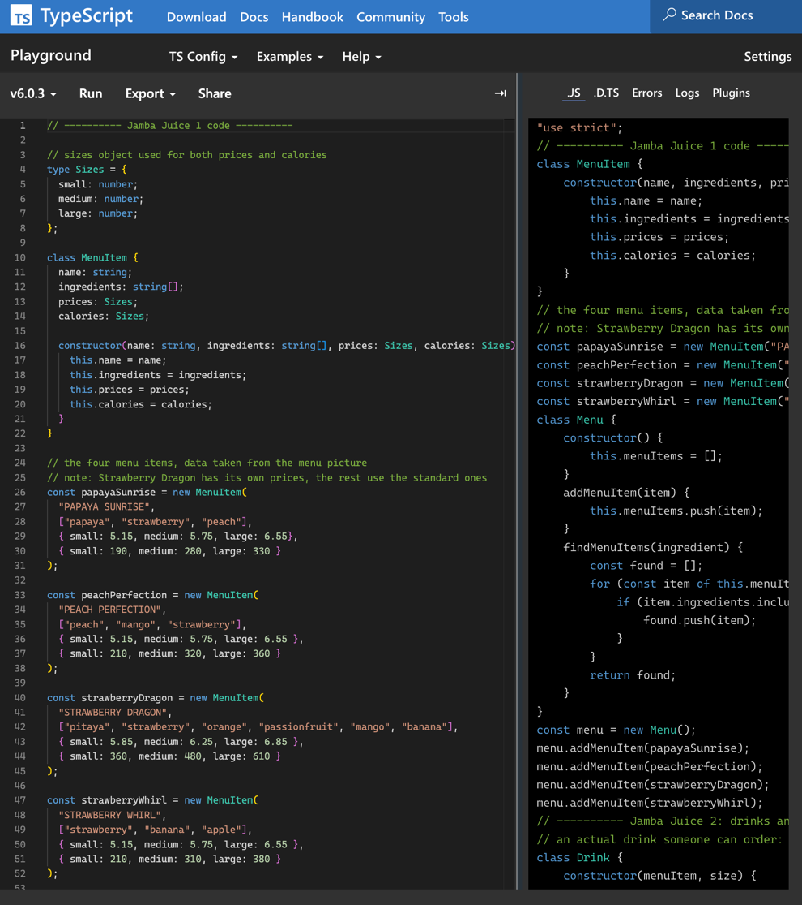

## A Python person meets TypeScript

I learned JavaScript over the summer, and before that most of my coding experience was in Python. So going into this module I expected TypeScript to be a fight. It was not. The syntax is actually relatively simple, and I prefer it over plain JavaScript. It feels closer to Python in terms of the keywords you use for things, and once you get used to typing semicolons everywhere, the language genuinely feels friendly.

The one thing that drove me crazy is constructors. Why do I have to do the same thing three times? You declare that name is a string, then the constructor takes a name that is a string, then you still have to write this line:

```typescript
this.name = name;
```

You already said the name is a string. Why do you have to say it again? In Python, the function just knows its parameters. If you mention a parameter inside the function, that is what you are mentioning. Coming from that, the TypeScript constructor pattern felt like pure repetition. I understand it better now, but my first reaction was honestly just annoyance.

Would I choose TypeScript for my own projects? Probably not yet. I still do not fully understand what the benefit is over just using a language like Python, so I do not see why I would switch. To be fair, the types have already saved me a couple of times. I misspelled a type name in one practice problem and the compiler caught it immediately, where Python would have happily run and blown up later. I can see how that safety net becomes the whole point on a big project with multiple people touching the same code. For my own small solo projects though, it still feels like extra ceremony for problems I do not have yet. But I can also say I enjoy coding in it, which I did not expect to say at the start.

## How I attack a WOD




The practice WODs felt pretty good to me, and I ended up with a system. I split my time into three chunks. First I read the entire problem and try to be really nitpicky about getting every requirement down. Then I write my plan as comments right in the editor: this is how I am going to make this class, this is how this function will work. The last chunk is actually coding it in TypeScript, and that is where I struggle. I blank on syntax constantly. I can read class code fine, but writing it from scratch is a different skill.

On the practice WODs, when I had tried my best and still had syntax problems, I would switch to AI and basically spam it with questions. What is the syntax for this? How do I make this for loop? Why am I getting this error? I also used AI a lot for generating test cases, since that part is more about coverage than cleverness. The course allows this on practice WODs as long as you disclose it, and my estimation log tracks the time I spent prompting versus coding.

My estimation log tells the story better than I can. I went 8 minutes estimated versus 15 actual, then 10 versus 13, then 25 versus 19:50, then 12 versus 25, then 27 versus 40. The interesting part is not that I was wrong, it is *why* I was wrong each time. Early on it was pure syntax recall. Then syntax got better and logic became the problem. Then on the corn hole quiz I lost points over something totally different: I did not fully understand how the scoring worked. A nitpicky detail in the question, and no amount of clean syntax saves you from that. My bottleneck keeps moving, and the WOD format is the reason I can even see it moving.

Is this style of learning stressful? Yes. Is it useful stress? Also yes. The timer forces you to find out what you actually know, instead of what you recognize when you read it. I think it will work for me.

## Arguing with the AI about rounding

AI has genuinely helped me learn, especially with syntax and with confusing wording in problem statements. When a problem has contradictory things happening in different paragraphs or charts, AI is good at helping me untangle it.

But AI has also failed me, and the best example is the heat index WOD. The assignment said to be as precautious as possible, to overestimate rather than underestimate so the safety warning would be higher. The AI used Math.round. I caught it and thought, why would you use round over ceil when the whole point is to err on the side of caution? We switched it to Math.ceil. The thing is, you would never know to question that if you did not understand what ceil and round actually do. That is the real lesson about AI for me: it is extremely useful, but somebody still has to be the person who understands the problem, because the tool will hand you a confident answer either way.

## How AI was used for this essay

This essay was written from a voice memo I recorded answering interview questions about the module. I used Claude to transcribe the recording, organize my own spoken sentences into sections, and clean up grammar. The ideas, opinions, and stories are mine from the recording. AI use on the practice WODs described above is also disclosed in my estimation log.
