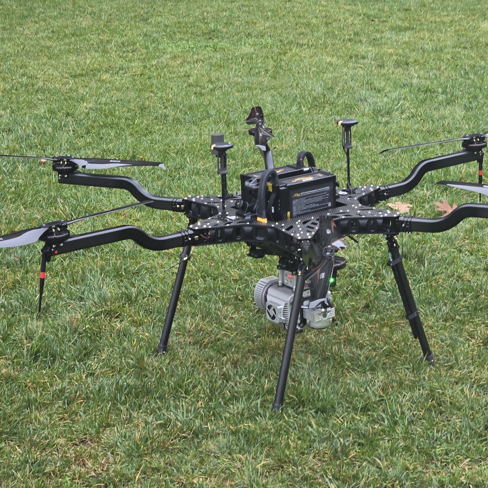

This project is an autonomous drone system where the camera and the brain live on different computers. The drone carries an ESP32-CAM, a tiny microcontroller with a camera attached, and I wrote the embedded C and C++ firmware that captures images in real time and streams them over UDP to a Linux machine running a ROS2 autonomy stack. On a chip that small, nothing is free. The firmware has to manage its timing and camera buffers carefully because there is barely any memory, and a frame that arrives late is almost as useless as a frame that never arrives at all when the drone is trying to react to what it sees.

My role covered both ends of the pipe: the firmware on the ESP32 side and the receive pipeline on the ROS2 side. The most interesting part was a performance problem. The effective stream rate had dropped to about 10 frames per second, which is not enough for visual servoing, meaning steering the drone based on what the camera sees. Instead of guessing, I traced where frames were actually being lost and found the bottleneck in the ROS2 receive pipeline, which was blocking while frames kept arriving. I rewrote it with non blocking I/O and added frame skip logic so the system always processes the newest frame instead of queueing up stale ones. That doubled the throughput to a stable 20 frames per second.

What I took away from this project is a respect for real time constraints and for measuring before fixing. My first instinct was that the ESP32 was just too weak, and if I had acted on that I would have redesigned the wrong end of the system. The actual fix was on the receiving side and it was small once I understood the problem. I also got comfortable working across the embedded and Linux worlds in one project, where the same bug can hide on either side of a UDP packet, and you have to be able to follow it across.

Source: <a href="https://github.com/A-Mundanilkunathil/Autonomous-Drone">github.com/A-Mundanilkunathil/Autonomous-Drone</a>
