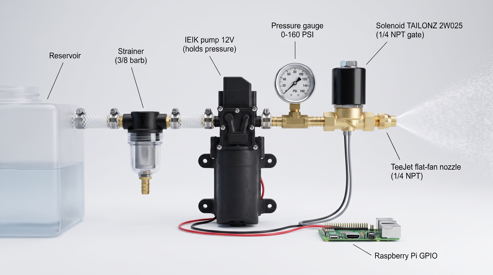

BotBox is a robot I am building to seal rooms on construction sites. The idea is a machine that can drive through a room and spray sealant on its own instead of a person doing it by hand. It is an ongoing personal build, and unlike a hackathon project it involves the whole stack of making a real machine work: the plumbing, the electronics, the embedded software, and the controls all have to come together on one chassis.

I have built it up subsystem by subsystem. The spray system runs off a Raspberry Pi driving pumps through relays, with a two pump water system and a solenoid valve that I speced out down to the fittings and thread standards. For choosing spray nozzles I wrote a small simulation bench in Python, calibrated it against a real measurement, and used it to compare flat fan nozzles before buying anything. The robot can follow me around using ultra wideband radios, three Qorvo DWM3001CDK modules doing distance measurements that I turn into a position. There is voice control using Vosk for speech recognition with spoken feedback through a speaker, and a handheld remote I built from a Raspberry Pi Zero 2 and a gamepad. Each of these runs as its own service that starts on boot, so the robot comes up ready without me touching anything.

This is a solo project, so my role is all of it: the design sketches, the parts sourcing and budget (about 774 dollars in parts so far), the wiring, the code, and the debugging. The debugging has taught me the most. My favorite example is the time the whole robot seemed to crash randomly, and after a lot of software suspicion it turned out the drive electronics cut power to the Pi whenever the motor battery dropped below a voltage threshold. Nothing in the code was wrong. I have learned that hardware projects punish assumptions, that boring things like connector standards and service files matter as much as clever algorithms, and that keeping a written record of decisions saves you when you come back to a subsystem months later. The code and design docs currently live in a private repo while the build is in progress.
