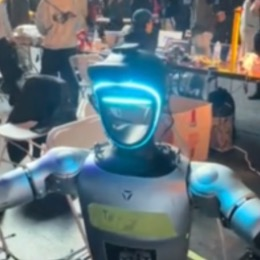

MIRAI is a project my team built at Cal Hacks 12.0, a hackathon at UC Berkeley with over 2,000 participants. We had a Unitree G1 humanoid robot, which is a full size 29 degree of freedom humanoid with an NVIDIA Jetson on board, and the idea was to give it three different ways to be controlled. There was an LLM action planner so you could just tell it what to do in plain language, a vision path using Gemini 2.5 Flash so it could look at a scene and pick out the object you asked about, and a pose mirroring path using MediaPipe where the robot copies your arm movements in real time. We ended up winning 1st place overall.

My piece of the project was the arm control. I implemented inverse kinematics for the right arm using Pinocchio on a reduced 7 degree of freedom model of the robot, so that when the vision or pose systems said "the hand should be here," my code figured out what every joint needed to do to get it there. Getting it to move smoothly was its own problem. I ended up tuning the stiffness and damping gains joint by joint, using lower stiffness and higher damping on the lower arm, because the first versions either oscillated or lagged behind the target. Watching the robot finally mirror my arm without shaking was the best moment of the weekend.

The biggest thing I learned is that real hardware is nothing like simulation. In sim your IK solution just works, but on the real robot every gain you pick has consequences you can feel and see, and you cannot iterate carelessly because the arm can actually hit things, including you. I also learned a lot about integrating with teammates under time pressure. My IK code had to accept targets from two completely different systems built by different people, so we had to agree on interfaces early and keep them stable while everything around them changed. That experience of splitting a hard problem across a team and having the pieces actually come together is what I want more of in software engineering.

Source: <a href="https://github.com/A-Mundanilkunathil/Unitree-G1">github.com/A-Mundanilkunathil/Unitree-G1</a>
