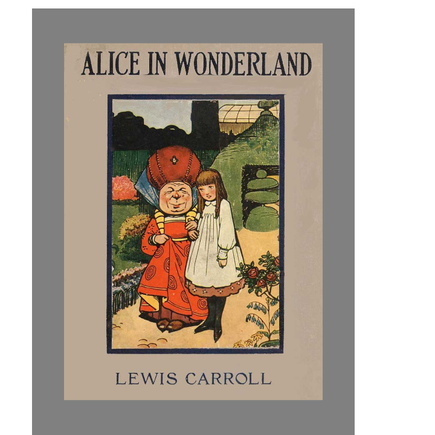

WeKindle is a web app for reading books with another person. The idea came from wanting to read the same book as someone without being in the same place, so it works like a shared Kindle: you load an EPUB, and two people can read it together with their progress synced. It is deployed and usable at <a href="https://we-kindle.vercel.app">we-kindle.vercel.app</a>.

I built it with Next.js, React, and TypeScript, using epub.js to parse and render the books and Supabase for the backend that keeps readers in sync. Getting an EPUB to render like a clean book page in the browser took more work than I expected, since every book formats itself a little differently, and the syncing logic has to handle two people who are not always online at the same time. I also set up Playwright tests to catch regressions in the reader, because a reading app that loses your place is an app nobody comes back to.

This was my first project where I owned a full product end to end: the idea, the design, the frontend, the backend, and the deployment. The biggest lesson was how much of a real app is not the fun core feature. The reader itself came together fast, but accounts, book storage, edge cases in EPUB formatting, and deployment details took most of the time. It gave me a much more realistic picture of what shipping software means, which is exactly the kind of thing I want to keep getting better at as a software engineer. The source is in a private repo, but the app is live at the link above.
